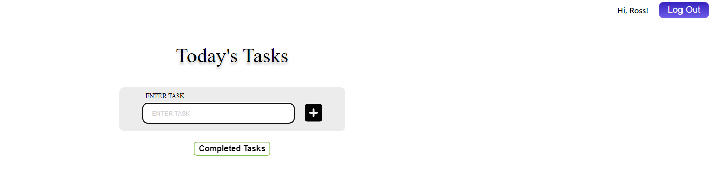

# ToDo App

## Description

The ToDo app allows users to create daily tasks in order to keep track of them. They have the option to edit or delete them. If tasks are complete they can click the checkbox to mark as complete which will disappear from the list. Completed Tasks can be viewed on different screen with click of a completed tasks button that displays a modal on screen.

# Table of Contents

- [Installation](#Installation)
- [Running Application](#Running-App)
- [Screenshot-of-Application](#Examples-of-Tasks-and-Completed-Tasks:)
- [Questions?](#Questions?)

# Installation

If you want to run this locally you will need to fork and clone repo. Add a .env to the server folder and add these lines of code for example:

```sh
PORT=5002
DB_HOST=localhost
DB_USER=root
DB_PASS=password
DB_SCHEMA=todo_db
```

You will need to update .env with your configuration to match your database and the Host and Port your server is running on.

### SQL Database

Using MySQL
Create a database using the the scripts provided by the file located at server/db/dbScripts.sql

- Sign in to your mySQL and open a new task window.
- Copy and paste scripts and run to create database and tables.

### Installing node modules

Frontend
-Open terminal inside the `todo-list-beckham` folder. \

- Run:

```
    npm i
    npm i --save @fortawesome/fontawesome-svg-core
    npm install --save @fortawesome/free-solid-svg-icons
    npm install --save @fortawesome/react-fontawesome
```

Backend
-Open terminal inside the `server` folder.\

- Run:

```
    npm init
    npm i express
    npm i mysql2
    npm i cors
    npm i nodemon
```

### Running App

In the project directory, you can run:

#### `npm start`

Frontend
-Run "npm start" inside the folder of the frontend part of the app in the terminal.\
 Open [http://localhost:3000](http://localhost:3000) to view it in your browser.

Backend
-Run "npm start" inside server folder in the terminal to start the backend server to connect to your database you created with scripts.\
 Will be running/listening on http://localhost:5002 by default in app based on the .env file you added.

## Examples of Tasks and Completed Tasks:




## Working Example


## Questions?

My gitHub user name is saltlifegoodlife, and you may email me at rossh.beckham@gmail.com for Questions.
